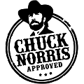
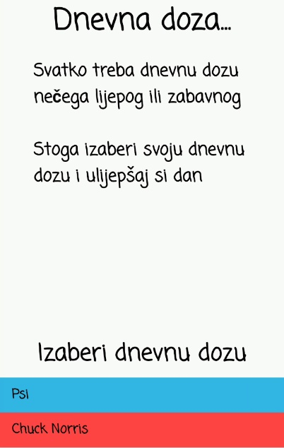

# Aplikacija Dnevna doza  
 

## Sadržaj
* [O aplikaciji](#o-aplikaciji)
* [Mock dizajn](#mock-dizajn-aplikacije)
* [Korišteni API-i](#api-i-koji-su-korišteni-u-aplikaciji)
* [Video zapis aplikacije u radu](#video-zapis-aplikacije-u-radu)
* [PowerPoint prezentacija](#powerpoint-prezentacija-aplikacije)
 
 

## O aplikaciji
Ideja ove aplikacije je korisniku uljepšati dan. 
Aplikacija korisniku omogučava izbor viceva o Chuck Norrisu i slike pasa. 

Za login u aplikaciju koristi se Google Sign in. 
 
 

## Mock dizajn aplikacije
Mock dizajn aplikacije je napravljen s online alatom NinjaMock 
 
[Mock dizajn](https://ninjamock.com/s/XB985Sx) 
 
 

## API-i koji su korišteni u aplikaciji
API sa slikama pasa -> [Psi](https://dog.ceo/dog-api/)  
 
API s vicevima o Chuck Norrisu -> [Vicevi](https://api.chucknorris.io/)  
 
 

## Video zapis aplikacije u radu
Za pokretanje videa **_klikni na sliku_** ispod

 
 
 

## PowerPoint prezentacija aplikacije 

 [PowerPoint prezentacija](http://tiny.cc/g2j98y)
